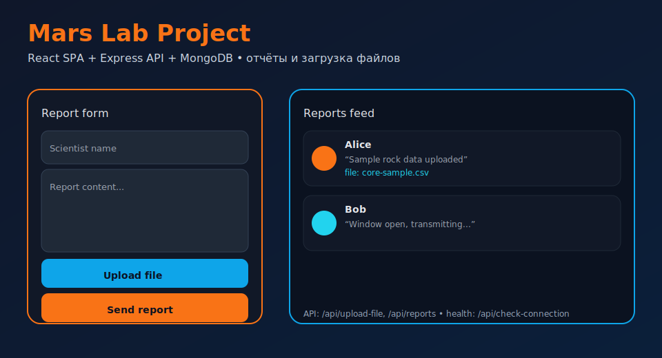

## Mars Lab Project



Мини-приложение для отправки и просмотра отчётов (Express + MongoDB + React).

### Quickstart
```bash
npm install && npm run build && npm start
# API: http://localhost:3000/api
```
`.env` (пример):
```
MONGODB_URI=mongodb://localhost:27017/mars_lab
PORT=3000
UPLOAD_DIR=uploads
```

### API (сжатая схема)
```bash
GET  /api/check-connection       # {"available": true}
POST /api/upload-file (FormData: file) -> {"fileName":"sample.bin"}
POST /api/reports {scientistName, reportContent, fileName?}
GET  /api/reports                # [{"scientistName":"...","fileName":"..."}]
```

### Архитектура
- `backend/src/app.js` — Express API, валидация входящих данных, загрузки через Multer.
- `frontend/src/` — React SPA (отправка отчёта, список /reports), сборка webpack в `frontend/public/bundle.js`.
- `uploads/` — сохраняются автоматически, раздаются статикой `/uploads`.
- `periods.json` — окна связи (health-check /api/check-connection).

### Quality
- Форматирование: eslint пока не подключён; стили/React собраны минималистично.
- Тесты: отсутствуют (ручные e2e), можно добавить jest/rtl; health-check покрывается вручную.
- Быстрый smoke: `npm run build` + `npm start`.
